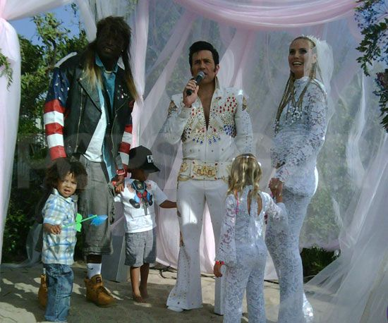

From the election of Donald J. Trump from 2016 onwards, the extent to which the
writings of Karl Marx and Friedrich Engels have been repeatedly referenced has
been quite shocking. That individuals would refer to themselves (unironically)
as "Marxists" during any year following the early 1990's seems to be quite
anachronistic. This is particularly striking given that the more vocal
self-described "Marxists" have been White/European members of the upper middle
class, and often have been slavishly obedient to corporate consumer culture.

## Muh Marxism Tho

For myself, I am completely unable to interpret the precise origins of this
behavior. It may well be rooted in illiteracy, as often times one finds a
reference to this strange phrase "market socialism":

> The idea was: socialism was planning; but there were others who said, no, socialism
> is about how you organize the society as a whole; how you organize production;
> how you organize politics and culture; but there is no problem in a socialist society
> using markets to distribute resources and products, letting different enterprises bargain
> and negotiate with one another, and accomplish distribution, that way the
> latter group was called market socialists, and the other one was called
> planned socialists

[Richard Wolff on "Market Socialism"](https://www.youtube.com/watch?v=8pjpS0q9efw)

While there is no doubt that, during the decades following 1960, there were many
who identified as these "market socialists", were these "Marxists"?

A brief survey of some publications by economic historians clearly indicates that
Marx and Engels did not, ever clearly state that markets had any role to be play
in their forecasted socialist revolutions to come. To quote Marx himself:

> ‘Within the cooperative society based on common ownership of the means of
> production’, he wrote, ‘the producers do not exchange their products’

[Roosevelt F. (1993) Marx and Market Socialism. In: Blackwell R., Chatha J., Nell E.J. (eds) Economics as Worldly Philosophy.](https://doi.org/10.1007/978-1-349-22572-9_14)

Further, there have been numerous topics, decades old, which have been published
addressing this recurring problem of self-identifying Marxists claiming that
Marx and Engels felt that a market was fundamental to a socialist revolution:

* [Nove, Alec. “‘Market Socialism’ and Its Critics.” Soviet Studies 24, no. 1(1972): 120–38.](https://www.jstor.org/stable/150784)
* [Chattopadhyay, P. (1998). Marx, Market, Socialism: Setting the Record Straight. Economic and Political Weekly, 33(35), 2317–2320.](http://www.jstor.org/stable/4407136)
* [Miller, D. (1987). Marx, Communism, and Markets. Political Theory, 15(2), 182–204.](https://www.jstor.org/stable/191674)

## Non-Marxist Socialists?

I am not at all knowledgeable on social philosophers who presented themselves as
socialists contra Marx/Engels, but more prominent figures (again, from the 19th
century) which sought some radical anti-competitive alternative to capitalism
included the likes of Ferdinand Lassalle, David Ricardo, and Pierre-Joseph
Proudhon. While fascinating to research, there are rarely cases in which any of
these influential anti-capitalists have really had some significant role or
impact on contemporary, Western faux-Marxism. More importantly, these individuals
even further distanced themselves from market-driven economics (with some
possible exceptions found in Proudhon and their followers; but certainly nothing
comparable to what is found in the love of the faux-Marxists for their NFL
merchandise, Starbucks drinks, and Apple products).

## Degenerate Consumerism?

I have, and often still, speculate that these social movements seem to have
their roots, instead, in a long-standing hatred of the upper-middle class for
white, rural members of the working class (as well as the poor). I find it
curious that, in juxtaposition to past attempts to foster a sense of solidarity
between white workers, non-westerners, and socialist intellectuals, there is a
peculiar loathing elitism to be found amongst these leftists. Take, for example,
the phenomenon of the "white trash party":

Here one finds the German-born model Heidi Klum engaged in a public ritual of scorn
and mockery for the poorest classes of US-American whites. Further, it should
also be noted that this was a wedding ceremony in which Klum was being married
to the musician Seal (Henry Olusegun Adeola Samuel). Seal, like Klum, was also
not a native US-American citizen, being born in the United Kingdom.

This is not a new phenomenon, as the marriage was held in 2005. One could even
attempt to connect this strange intraracial hatred of poor and working class
whites by white members of the upper-middle class to the early 1970s. Less
fortunate US-American whites who were unable to avoid conscription and having
been forced to survive the horrors of Vietnam, arrived at long last to their
homes only to find upper-middle class whites screaming "baby killer" and
spitting upon them:

> I mean, they called us baby killers, everything you could think of. And like I
> said I was getting on a plane, they spit on us and...it wasn't, it wasn't
> good.

[Remembering Vietnam: Baby Killer](https://www.youtube.com/watch?v=bzWs2Uu8I9c)

## Conclusions

While these are just speculations, I still do strongly feel that these
undercurrents indicate that the roots of these movements lie with a hateful
disgust for those members of US-American society who sacrificed themselves
for this nation, and now find themselves the target of
persecution by those they sought to protect. While these circumstances are
extremely tragic, I do actually find some optimism within the gloom of the
modern era. I look forward to posting more on this topic.

