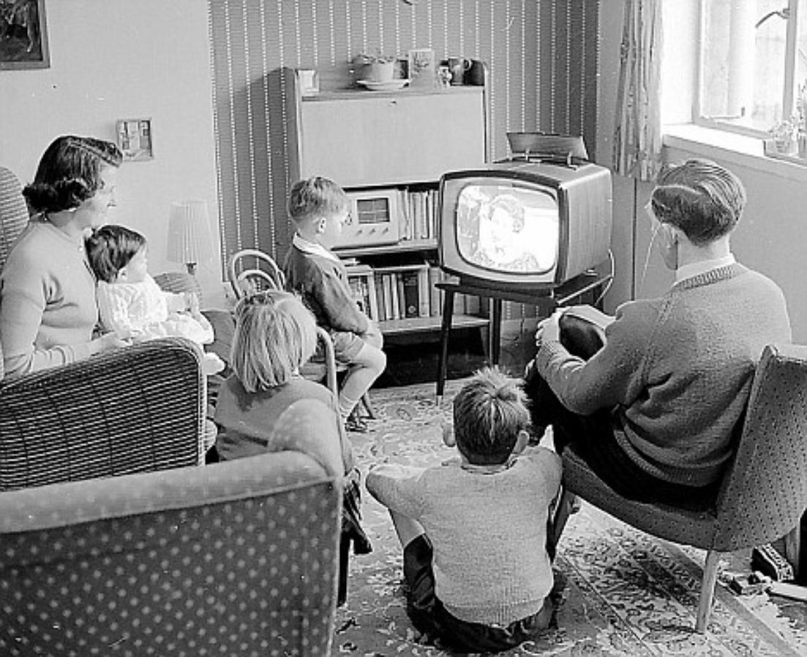
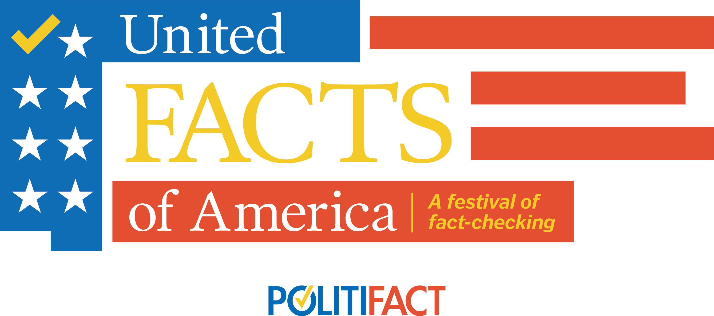

As stated in one of my previous posts, I have, for more than one decade, been
long aware of much of the leftist political movements which have, over the past
two years, more openly asserted their dominance over the public sphere in the
West. It is a fortunate time for those such as myself; When I attempted to raise
awareness of these threats while much younger, I was eagerly dismissed as a
lunatic and ridiculed. This was a primary factor in my distancing from any and
all political discussions prior to 2019. I had concluded that Westerners
(particularly those neighboring me) would remain blind to their own
self-destruction, and willingly embrace their own eradication or enslavement.
Today, many Westerners, and most surprisingly, Europeans, are finally becoming
politically active in response to the constant attacks upon their own
national governments, heritage, personal liberties, and people.

## Media and Propaganda

Much of this would not have been possible without the usage of mass indoctrination
on behalf of the corporate media (as well as, in some cases, national
governments as well). The technology most often used has been television,
however, the rise of social media (most notably, Facebook, Twitter, Instagram,
Snapchat, and TikTok) has provided further avenues by which to restrict and
distort the worldview of Western citizens.

The beneficial impacts of television have been contentious at best. As a
foundational step towards the development of the personal computer and the
establishment of the World Wide Web, it has served as an incredible intermediary
technology. However, by any sensible measure, the entertainment programming has
dominated the airwaves and cable TV for many decades. The corporate news media,
along with televised sports have been the most successful in ensuring that the
citizenry stay restrained in their tolerance range for entertainment, and
trusted sources for information. One sees the impact of this made very obvious
today with the advent of programs such as "Reliable Sources" and the usage of
"fact-checkers" (a neologism crafted by those too illiterate to employ
terms such as "editor" or "researcher").

*Yes, this was a real event*

This used to impel the demographics of television fanatics to seek to demonize
those who seek alternative sources
of news or information (typically in the form of the text or video recorded by
citizen journalists).

That the World Wide Web has provided many with the freedom to share information more
freely and without restriction has provided the perfect narrative for the TV
dogmatists to employ endlessly: information sources uncensored by media
conglomorates and the state are being "hijacked" by some foreign or malicious
entities for the purposes for spreading disinformation. Within the United
States, this false narrative most commonly uses the Russian Federation as the
primary culprit (often, to absurd and comedic extremes, such as implying that
WikiLeaks is somehow an apparatus of the Russian Federation):

<iframe width="560" height="315" src="https://www.youtube.com/embed/bAMt1KMqXdM?start=37" title="YouTube video player" frameborder="0" allow="accelerometer; autoplay; clipboard-write; encrypted-media; gyroscope; picture-in-picture" allowfullscreen></iframe>

This is not to deny that the Russian Federation certainly does employ the usage
of teams of individuals spreading disinformation using social media. However,
there are any number of other nations (namely, the People's Republic of China,
North Korea, and Iran) who have been exposed in the past for engaging in massive
cyberattacks upon the United States. To assume that these nations are also not
engage in spreading disinformation is naive and foolish.

Further, what precisely constitutes a "Russian" disinformation campaign is never
clearly outlined. Are these disinformation agents working on behalf of the
Russian government? Are they employees of private firms working instead on
behalf of some unknown clients? Are these individuals *confirmed* as residing in
Russia, or are they simply traced to an IP address located *in* Russia? (One
could very easily use a Virtual Private Network in order to achieve the latter).

The government of the Russian Federation is not well-known for its leniency
shown towards any form of cybercrime, and there are documented cases in which
government agencies have cooperated with the United States in order to prosecute
and incarcerate suspects:

[Russia says it dismantled REvil hacking group at US request](https://www.aljazeera.com/news/2022/1/15/russia-says-it-took-down-revil-hacking-group-at-us-request)

And what of other nations? Latin America? Other European nations? Gulf
Arab nations? Black hat criminals operating in Canada or Australia? The absence
of any reported attacks originating from so many nations with well-established
web infrastructure is extremely curious.

## Media and Globalisation

Often in coordination with the continued adoption of television throughout the
globe has been the extension of a specific form of cultural imperialism. From
approximately the 1970's onwards, much of this has consisted of leveraging the
appeal of television to those outside of the United States to the advantage of
multinational corporations seeking to promote their products or services to new,
foreign demographics.

<iframe width="560" height="315" src="https://www.youtube.com/embed/MdcWK7axuH8?start=37" title="YouTube video player" frameborder="0" allow="accelerometer; autoplay; clipboard-write; encrypted-media; gyroscope; picture-in-picture" allowfullscreen></iframe>

This post could not possibly endeavor to provide a thorough outline of the
process of globalisation. However, it is quite clear that, by the arrival of
1980 within the US, this process had clearly begun to amass critical momentum.

<iframe width="560" height="315" src="https://www.youtube.com/embed/ckbfS99N6jY?start=37" title="YouTube video player" frameborder="0" allow="accelerometer; autoplay; clipboard-write; encrypted-media; gyroscope; picture-in-picture" allowfullscreen></iframe>

The first amongst those to stand opposed to the consumption of US and Western
media outlets were religious fundamentalists and Marxist-Leninists. Fidel Castro
infamously attacked US media:

<iframe width="560" height="315" src="https://www.youtube.com/embed/d_OQBEDgwOc?start=71" title="YouTube video player" frameborder="0" allow="accelerometer; autoplay; clipboard-write; encrypted-media; gyroscope; picture-in-picture" allowfullscreen></iframe>

...while leaders of the Islamic world such as Ayatollah Khomeini and Usama Bin
Laden explicitly stated the need to censor and restrict the spread of this
media:

<iframe width="560" height="315" src="https://www.youtube.com/embed/CMCtxxT_9GM?start=850" title="YouTube video player" frameborder="0" allow="accelerometer; autoplay; clipboard-write; encrypted-media; gyroscope; picture-in-picture" allowfullscreen></iframe>

With the extreme rise in prosperity and the continued expansion of the middle
class within the United States and Western nations, classifying such views as
symptomatic of an extremist ideology could be done with ease. And for many,
exposing their children to harmless advertisements for products such as Fruit
Loops or McDonald's cheeseburgers seemed harmless enough. Thus, most willingly
embraced an extremely restrictive, controlled form of media as a luxury; this
was to be considered a benefit of living within a modern, developed nation.

### The North American Free Trade Agreement (NAFTA)

Signed into law by President William J. Clinton in 1994 (although, this
agreement was architected primarily by predecessor George H. W. Bush), the NAFTA
fundamentally damaged the industrial manufacturing base of the US. Under the
Clinton administration, one began to see a number of fundamental, destructive
changes within the United States, some of which included:

* Massive outsourcing of labor within the automotive industry
* Destruction of the semiconductor and steel manufacturing industries
* The fabrication of the fictional firearms class "assault weapon", and
  subsequent restrictions impose upon their sale.
* In 1990, Walmart became the largest US retailer by revenue. By 1997,
  Walmart was added to the Dow Jones Industrial Average. The rise of Walmart as
  the dominant retail outlet inflicted significant damage upon small business
  owners across the US.
* The involvement of NATO forces (including US combat aircraft) in the
  intentional targeting of Serbian civilians during the Yugoslav Wars. To date,
  no Western leaders have been held responsible for their involvement in these
  atrocities.

The massive unemployment triggered by these oncoming waves of outsourcing to
manufacturing facilities outside of the US were responded to by political
leadership with promises of increased resources provided using social welfare
programs. Clinton specifically sought to appeal to the demographic of Black
Americans, constituting approximately 12.7% of the US population as of 1997 [^1].
To quote Nobel Prize-winning author Toni Morrison (herself Black American):

> Clinton displays almost every trope of blackness: single-parent household,
> born poor, working-class, saxophone-playing, McDonald's-and-junk-food-loving
> boy from Arkansas [^2]

It must also be noted that the US Census at 1997, Hispano-American (termed
"Hispanic Origin Status") are disambiguated from White, Black, American Indian,
Eskimo, Aleut, Asian, and Pacific Islanders. They were reported to constitute
approximately 18.3% of the US population in 1997 [^3]. To date, we have yet to
have a US President who "displays almost every trope of" Hispano-American cultural
identity.

### Entertainment Media and Television

The early and mid-1990's saw the rise of a significantly more prosperous and
well-entrenched music industry, which most notably established its reign over
the members of "Generation X" and "Millenial Generation" using the introduction
of VH1 and Music Television (MTV) over cable television. While there would be
periodic challenges from select genres of music, this period would come to
concentrate the power to direct popular taste in music within a select number of
record industry corporations. This would also initiate a period in music which
has yet to fully conclude; the rise of Hip Hop as a popular genre amongst
upper-middle class White young adolescents.

To provide some context for this, it may be useful to review the pace of change
in popular music genres and styles prior to 1994:

* 1956 Release of "Hound Dog" covered by Elvis Presley (Rockabilly)
  * (this remained the top-selling release on the pop chart for 11 weeks; a 36-year record)
* 1964 Release of "Introducing...The Beatles" (Rock and Roll, released from the UK)
* 1969 Release of "Led Zeppelin" (Hard rock and blues rock, released from the UK)
* 1969 Release of "Live/Dead" by the Grateful Dead (Psychedelic and blues rock)
* 1970 Release of "Black Sabbath" (Heavy metal)
* 1971 Release of "ZZ Top's First Album" by the ZZ Top (Texas blues rock)
* 1972 Release of "The Rise and Fall of Ziggy Stardust..." by the David Bowie (Glam Rock)
* 1975 Release of "Jive Talkin'" by the Bee Gees (Disco)
* 1977 Release of "Never Mind the Bollocks, Here's the Sex Pistols" by the Sex Pistols (Punk Rock)
* 1980 Release of "Freedom of Choice" by Devo (Synth-pop)
* 1980 Release of "Face Value" by the Phil Collins (Pop rock)
* 1986 Release of "Reign in Blood" by Slayer (Thrash metal)
* 1988 Release of "Open Up and Say... Ahh!" by Poison (Glam metal)
* 1990 Release of "Violator" by Depeche Mode (Synth-pop)
* 1991 Release of "Nevermind" by Nirvana (Grunge)

From the mid-1990's, throughout the 2000's, 2010's, and until 2022, change in popular
music genres came to an extreme halt. For example, please compare the following:

<iframe width="560" height="315" src="https://www.youtube.com/embed/fPO76Jlnz6c" title="YouTube video player" frameborder="0" allow="accelerometer; autoplay; clipboard-write; encrypted-media; gyroscope; picture-in-picture" allowfullscreen></iframe>
(Coolio - Gangsta's Paradise, 1995)

<iframe width="560" height="315" src="https://www.youtube.com/embed/RM7lw0Ovzq0" title="YouTube video player" frameborder="0" allow="accelerometer; autoplay; clipboard-write; encrypted-media; gyroscope; picture-in-picture" allowfullscreen></iframe>
(JAY-Z - The Story of O.J., 2017)

Note that the visual message is also identical: Black Americans are oppressed and
enthralled within poverty, forever the victims of Whites, who lord their wealth and
power over them incessantly.

This interval spans a duration of 22 years, and, as one can observe, the same
genre of music remains dominantly or exclusively promoted by record industry
corporations. Coolio's "Gangsta's Paradise" sold more than 5 million copies
within the United States, with it ranking as the best selling single of 1995.
As of 2022, Jay Z's estimated net worth is reported to exceed one billion US dollars.

## US American Cultural Imperialism Becomes US Black Cultural Imperialism

<iframe width="560" height="315" src="https://www.youtube.com/embed/ucX3VdpuBe8" title="YouTube video player" frameborder="0" allow="accelerometer; autoplay; clipboard-write; encrypted-media; gyroscope; picture-in-picture" allowfullscreen></iframe>

As indicated by the date of this video (2018), US cultural imperialism clearly
transferred from the popular rock of the 1970's into the hip-hop cultural of the past 22 years.
Far from being victims of oppression, this demographic has been constantly promoted, and
showered with the wealth accrued by previous generations of upper and upper-middle class leftist
American families. This, in itself, is not a criticism; market demand is often
driven by propagandized tastes formed in youth or adolescence. Why else would
advertisements for products such as Lucky Charms even have been funded for more
than one year?

<iframe width="560" height="315" src="https://www.youtube.com/embed/s1rVBZVLh2I" title="YouTube video player" frameborder="0" allow="accelerometer; autoplay; clipboard-write; encrypted-media; gyroscope; picture-in-picture" allowfullscreen></iframe>

It need not be stated that human societies thrived for centuries without the
consumption of sugar-coated marshmallows. And this is certainly not any sort of
proposal to demand that any state authority direct the taste of consumers away
from hip-hop or Cocoa Krispies. Censorship, at any point during this process,
would have introduced far more severe, destructive consequences.

However, I contend that much of this consumer behavior forms a fundamental
foundation upon which much of the Black-supremacist "Black Lives Matter" and
critical race theory movements which have received so much support from the US
federal government and multinational corporations.

I hope to post a new article addressing more aspects of this topic soon. Thank
you for your attention.

[^1]: https://data.census.gov/cedsci/table?q=United%20States&y=2018
[^2]: http://ontology.buffalo.edu/smith/clinton/morrison.html
[^3]: https://data.census.gov/cedsci/table?q=United%20States&y=2018

